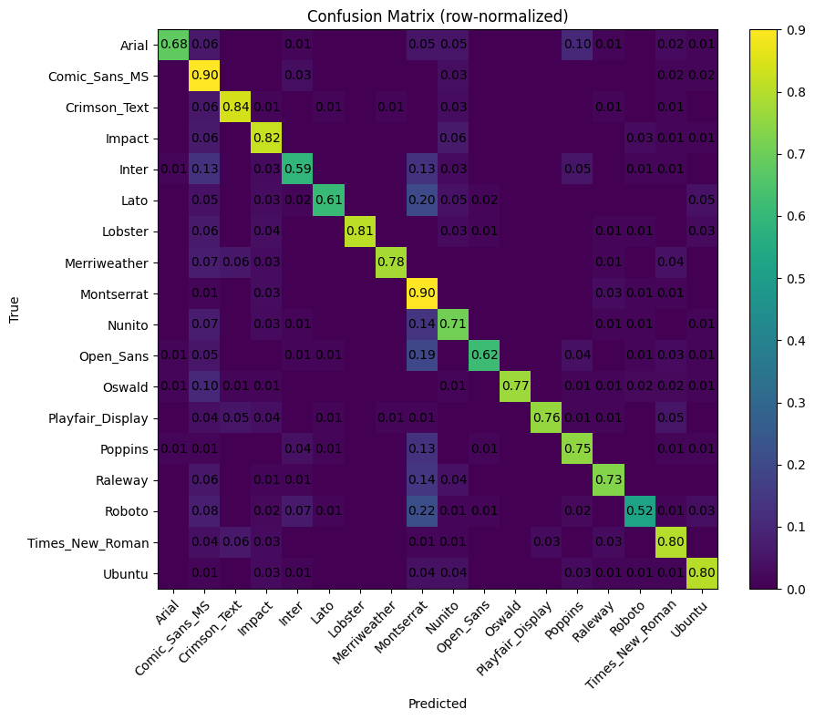

# Edit Anything

**Edit Anything** is an AI-powered text editing tool that lets you extract, modify, and recompose text in any image while preserving the original design.

## ✨ Features

### 🎯 **Smart Text Detection & Analysis**

- **Automatic text detection** with bounding box visualization
- **Intelligent consolidation** groups related text blocks by color
- **Font property analysis** detects size, family, color, alignment, and rotation
- **Two-pass text removal** ensures complete background cleaning

### 🖊️ **Interactive Text Editing**

- **Click-to-edit** any detected text inline
- **Drag & drop** text boxes to reposition them
- **Resize handles** for adjusting text box dimensions
- **Real-time preview** of all modifications

### 📤 **Professional Export**

- **High-quality composite** downloads at original resolution
- **Perfect text rendering** matches preview exactly
- **PNG format** with transparency support
- **Consistent font scaling** between preview and export

## 🚀 **How It Works**

1. **Upload** an image containing text
2. **Detection** - AI automatically finds and analyzes all text
3. **Cleaning** - Background image generated with text removed
4. **Editing** - Modify, move, resize, or rewrite any text
5. **Export** - Download the final composed image

## 🛠️ **Technical Stack**

- **React + TypeScript** for the frontend
- **Google Gemini AI** for text detection and image processing
- **HTML5 Canvas** for precise text rendering and export
- **Vite** for build tooling
- **Tailwind CSS** for styling

## 🎨 **Perfect For**

- **Designers** creating variations of existing graphics
- **Marketers** localizing promotional materials
- **Content creators** updating text in branded images
- **Anyone** who needs to edit text in images without Photoshop

## 🏃‍♂️ **Development**

```bash
npm install
npm run dev
```

Requires a Google AI API key in your environment variables.

## 🔑 **Setup**

1. Clone the repository
2. Install dependencies: `npm install`
3. Create a `.env` file with your API key:
   ```
   API_KEY=your_gemini_api_key_here
   ```
4. Start the development server: `npm run dev`

## 📁 **Project Structure**

```
edit-anything/
├── src/
│   ├── components/        # React components
│   │   └── OverlayComponent.tsx
│   └── services/          # Business logic
│       ├── aiService.ts   # AI/LLM operations
│       └── exportService.ts # Image export functionality
├── App.tsx               # Main application
└── README.md
```

## 🤝 **Contributing**

Pull requests welcome! This project uses:

- TypeScript for type safety
- ESLint for code quality
- Tailwind for styling
- Clean architecture with separated concerns

---

**Edit Anything** - Because sometimes you just need to change that one word in a perfect design. ✨

### Model confusion matrix


